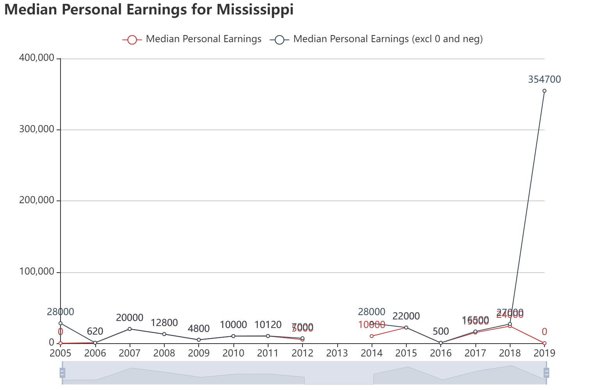
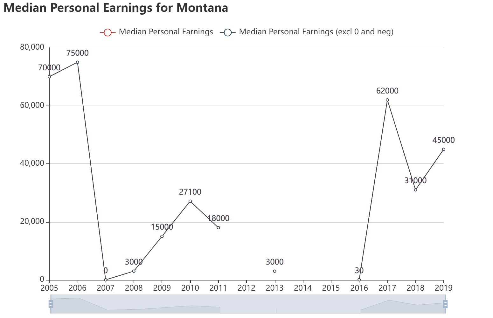

# Income

## General 

For most of states, the average income are increasing from 2005 to 2019. 

Some of states, the median personal earnings fluctuate among these years.

MA, CA, CT, FL, MI, NJ, NY, PA, TX have a clearing increasing pattern.

Some states such as AZ, CO, CT, MD, NJ, NV  have a decreasing  pattern around 2008 to 2012.

## By state

### Alabama

The income drops from 2005 to 2012 and then increasing from 2012 to 2019.

### Alaska

The data in Alaska varies dramatically due to the data loss and the lack of sampling, the pattern is hard to tell.

### Arizona

The income increasing from 2010 and reach the peak at 2015 and then drop. The overall income difference between 2019 and 2005 is negligible.

### Arkansas

The income slightly decreases from 2010 to 2019.

### California

The income increases from 2005 to 2019.

### Colorado

The  income decreases from 2007 to 2012 and then increases.

### Connecticut

The income reaches a local peak at 2008 and then decreases until 2011 and then increases.

### Delaware

There are too many empty data for Delaware.

### District of Columbia

The income increases from 2012 to 2019.

### Florida

The income increase from 2005 to 2019

### Georgia

The income slowly increases from 2005 to 2019 with fluctuation.

### Hawaii

The income slowly increases from 2005 to 2019 with fluctuation.

### Idaho

Too many missing data.

### Illinois

The income slowly increases from 2005 to 2019 with fluctuation.

### Indiana

The income slowly decreases from 2005 to 2019 with fluctuation.

### Iowa

Missing data.

### Kansas

The income slowly increases from 2005 to 2016 and then decreases.

### Kentucky

The income slowly increases from 2005 to 2019.

### Louisiana

The income slowly increases from 2005 to 2019.

### Maine

Too many missing data.

### Maryland

The income reaches peak at 2008 and then decreasing from 2008 to 2012 and then increasing.

### Massachusetts

The income slowly increases from 2005 to 2019.

### Michigan

The income slowly increases from 2005 to 2019 with fluctuation.

### Minnesota

The income slowly increases from 2005 to 2012 and from 2016 to 2017, decreases from 2012 to 2016 and from 2017 to 2019.

### Mississippi

Too many missing data.

### Missouri

The income slowly increases from 2005 to 2019 with fluctuation.

### Montana

Too many missing data.

### Nebraska

Too many missing data.

### Nevada

The income reaches peak at 2008 and then decreasing from 2008 to 2013 and then increasing.

### New Hampshire

The income fluctuates between 2005 and 2016, then increases.

### New Jersey

The income reaches peak at 2008 and then decreasing from 2008 to 2013 and then increases until 2018.

### New Mexico

The income increases until 2007 and then decreasing until 2009 and then increasing.

### New York

The income increases from 2005 to 2019.

### North Carolina

The income slowly increases from 2005 to 2019 with a lot of fluctuation.

### North Dakota

Too many missing data.

### Ohio

The income slowly increases from 2005 to 2019 with fluctuation.

### Oklahoma

The income slowly increases from 2005 to 2019 with fluctuation.

### Oregon

The income increases until 2009 and then decreasing until 2014 and then increasing drastically.

### Pennsylvania

The income slowly increases from 2005 to 2019 with fluctuation.

### Puerto Rico

Missing data.

### Rhode Island

The income increases until 2009 and then decreases until 2012 and then increases.

### South Carolina

The income slowly increases from 2005 to 2019 with fluctuation.

### South Dakota

Too many missing data.

### Tennessee

The income increases from 2005 to 2012 then decreases.

### Texas

The income slowly increases from 2005 to 2019 with fluctuation.

### Utah

The income slowly increases from 2005 to 2019 with fluctuation.

### Vermont

Too many missing data.

### Virgin Islands

Missing data.

### Virginia

The income slowly increases from 2005 to 2012 then decreases with fluctuation.

### Washington

The income slowly increases from 2005 to 2012 then decreases.

### West Virginia

Too many missing data.

### Wisconsin

The income slowly increases from 2005 to 2012 then decreases until 2017 and increases.

### Wyoming

Too many missing data.