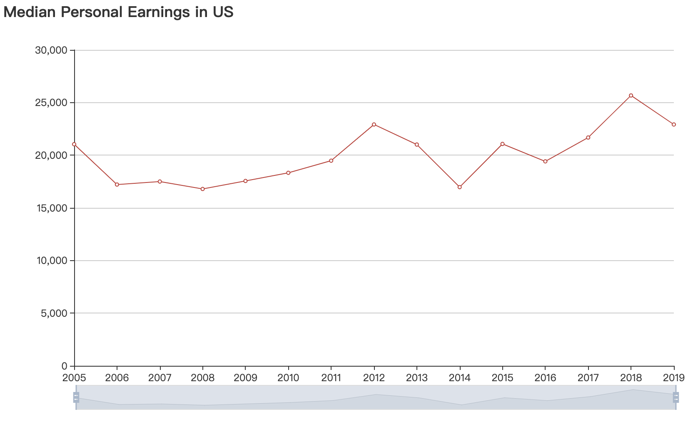
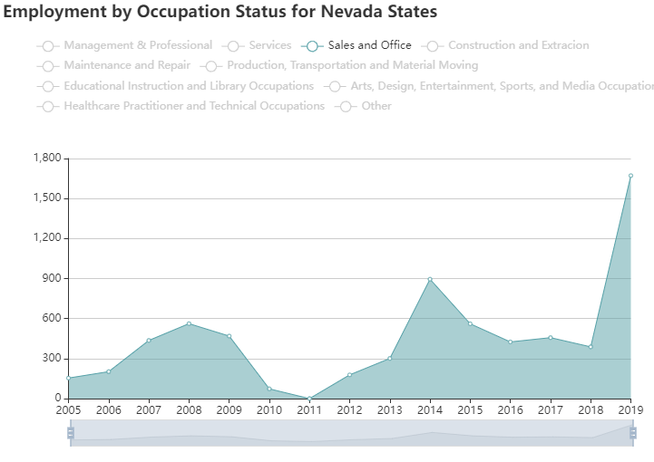

# Team 3: Deliverable 4 (Draft Report)

## Project: BPDA | Brazilian Community Census Analysis

| Team Member:   |                 |
|:-------------- | --------------- |
| Zhihao Gu      | zhihao97@bu.edu |
| Chenyang Zhang | zhangcy@bu.edu  |
| Minghui Yang   | yjasmine@bu.edu |
| Xiaohan Zou    | xh@bu.edu       |
| Pengchao Yuan  | yuanpc@bu.edu   |

## Data

Data are provided by the BPDA, both per year and per State.

* Preprocessed Brazilian Immigrants data
  * Population
  * Age distribute
  * Gender
  * Marital status
  * Citizenship
  * Education
  * Employment
  * Income
    Data

## Visualization and Result Analysis

**For details analysis and graph, please refer to the** ```Team 3 Code/specific type```. Each folder includes the graph and according analysis file which provide per Sates analysis.

There is also a html file ```Team 3 Project Deliverable/directory.html``` that contains all the plots.

See [chart page](directory.html) for charts we plot.

### Population


The population is stable from 2005 to 2015, but increase rapidly (about 50% in 5 years) from 2015 to 2019. 

### Age


The average age in US is around 36, and gradually increasing from 34 to 38 since 2015 to 2019.

### Gender


The gender proportion drops a little from 2005 to 2010 then remains the same from 2010 to 2019  around 45% for male. 

* The gender proportion by states is not suitable to analysis due to high variance.

### Income

* Overall pattern in US

  

  The median personal earning in US increases from 2005 and then drops from 2012 to 2014 then re-increases afterwards.

* Special patterns
  
  * For some states, the median income increases among these years such as MA, CA, CT, FL, MI, NJ, NY, PA, TX.
    
    
    
  
  * For some states, there is a clear decreasing pattern around 2008 to 2012  such as AZ, CO, CT, MD, NV. The reason we assume is the global financial crisis. But there are states that the income does not decrease, probably due to the industrial structure difference.
    
    
    
    
    One explanation for this is looking at the employment status for these states. The sales and Office type is most related to the income in this case. But for some cases, it does not match anymore. So we decide to give 
    
    
    

### Education

For about 9 states, the number of bachelor’s degrees or higher are always larger than the other three types and continue to rise. The number of the other three types is very stable and is always at a relatively low level. Such as IL, IN, MI.

For about 12 states, the number of the four data types fluctuated greatly, and there was not overall upward or downward trend.


### Employment

- General

  - In almost all of the states, most of the employees are Private Wage and Salary Workers.

- Typical patterns

  Here we summarize some typical trend patterns. See [here](../Team%203%20Code/employment/README.md) for detail analysis of all states.

  - In some states such as Arizona (AZ), the total number of employees generally rised, despite a few transient descends:

    

  - In some states such as Florida (FL), the numbers of all the four types of employees kept fluctuating during 2005-2019:

    

  - The numbers of employees of some states have obvious peaks. For example, the number of Private Wage and Salary Workers in Kentucky has two peaks (2009 and 2017):

    


## Poverty
- Individuals above Poverty
  - The pattern is same as population. 
  - MA and FL is the top 2 states which larger than any other states

- Individuals below Poverty
   - MA and FL is always the top 2 states
   - Overall, it maintains an upward trend

- Not determined
  - The pattern looks random, and hard to find trend
  - The amount is increasing in general
  
## Reproduce Instruction

* Use Jupyter Notebook to regenerate graphs. Cells run in sequence and make sure the required dependences are installed properly.

* The column and row index in the cdv file must be matched.

* To generate graph with different sort order, change the ```sort_by``` parameter and re-run the cell.
